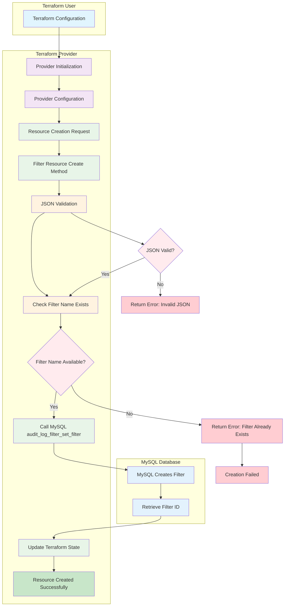

# Audit Log Filter Creation Flow (Clean Slate)

## Overview
This diagram illustrates the complete flow when a new audit log filter is created from a clean slate using the Terraform provider.



## Step-by-Step Flow

### 1. Terraform Configuration
- User defines the filter in Terraform configuration
- Example:
  ```hcl
  resource "auditlogfilters_filter" "example" {
    name       = "example_filter"
    definition = jsonencode({...})
  }
  ```

### 2. Provider Initialization
- [`main.go`](main.go:35) starts the provider server
- [`provider.New()`](internal/provider/provider.go:207) creates provider instance

### 3. Provider Configuration
- [`provider.Configure()`](internal/provider/provider.go:75) method is called
- Establishes MySQL connection using credentials
- Verifies `audit_log_filter` component exists
- Passes database connection to resources

### 4. Resource Creation Request
- Terraform calls the [`Create()`](internal/provider/audit_log_filter_resource.go:100) method
- Reads planned configuration from Terraform

### 5. JSON Validation
- Validates the filter definition is valid JSON
- [`json.Unmarshal()`](internal/provider/audit_log_filter_resource.go:112) checks syntax

### 6. Check Filter Name Exists
- Queries `mysql.audit_log_filter` table for existing filter with same name
- [`SELECT COUNT(*) FROM mysql.audit_log_filter WHERE name = ?`](internal/provider/audit_log_filter_resource.go:123)

### 7. Filter Name Available?
- If name exists, returns error
- If name is available, proceeds to create filter

### 8. Call MySQL audit_log_filter_set_filter
- Executes MySQL function: `SELECT audit_log_filter_set_filter('name', 'definition')`
- [`db.QueryRow(query).Scan(&result)`](internal/provider/audit_log_filter_resource.go:141)

### 9. MySQL Creates Filter
- MySQL creates the filter in the `mysql.audit_log_filter` table
- Returns "OK" on success

### 10. Retrieve Filter ID
- Queries the newly created filter to get its internal ID
- [`SELECT filter_id FROM mysql.audit_log_filter WHERE name = ?`](internal/provider/audit_log_filter_resource.go:160)

### 11. Update Terraform State
- Sets computed values (`id`, `filter_id`)
- Saves resource state to Terraform state file
- [`resp.State.Set(ctx, &data)`](internal/provider/audit_log_filter_resource.go:171)

### 12. Resource Created Successfully
- Terraform reports successful creation
- Filter is now active and can be assigned to users

## Key Points

- **Clean Slate**: Assumes no existing filters with the same name
- **JSON Validation**: Ensures filter definition is syntactically correct
- **Name Uniqueness**: Enforced at the application level
- **MySQL Integration**: Uses MySQL's built-in audit log filter functions
- **State Management**: Properly tracks filter ID and definition
- **Error Handling**: Comprehensive error handling for database operations

## Database Schema

The filter is stored in MySQL's `mysql.audit_log_filter` table:
- `filter_id`: Auto-incrementing ID
- `name`: Filter name (unique)
- `filter`: JSON definition of the filter rules

## User Assignment Flow (Optional)

After filter creation, users can be assigned to the filter using:
```hcl
resource "auditlogfilters_user_assignment" "example" {
  username    = "admin"
  userhost    = "%.example.com"
  filter_name = auditlogfilters_filter.example.name
}
```

This follows a similar pattern but uses `audit_log_filter_set_user()` MySQL function.